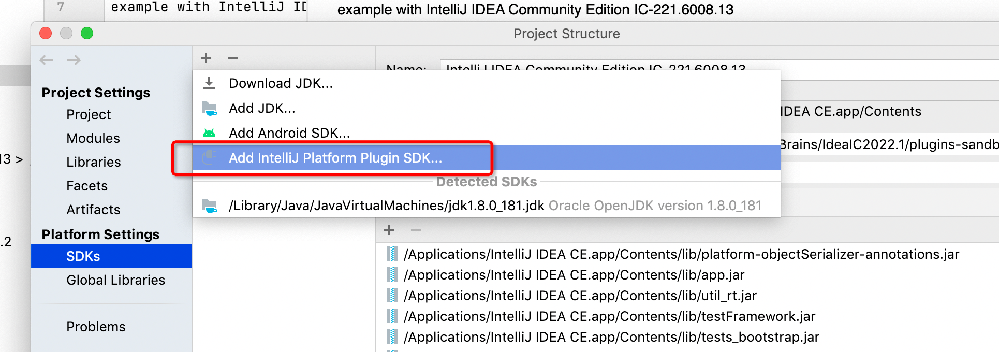
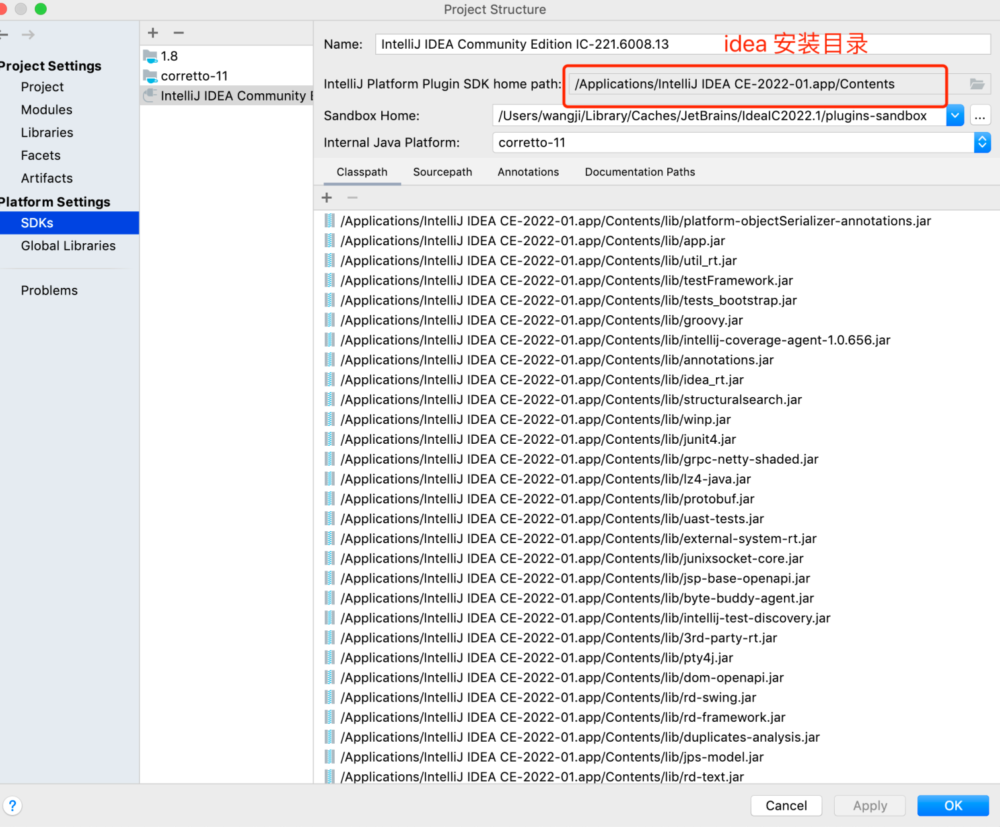
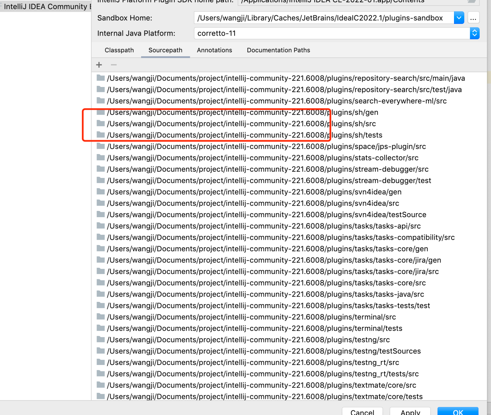
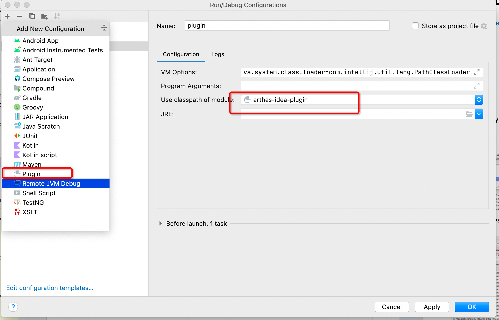
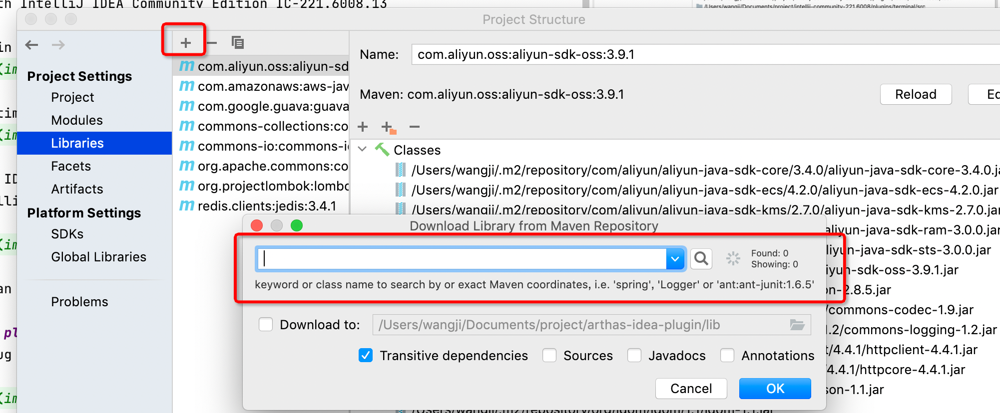
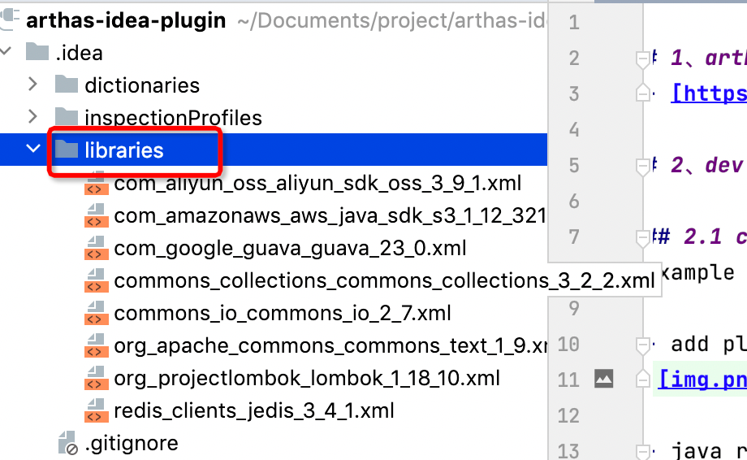
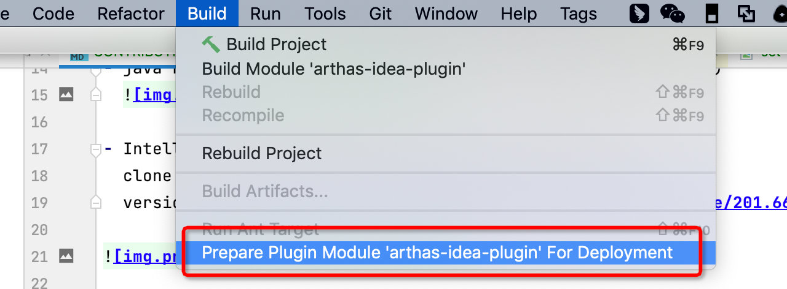
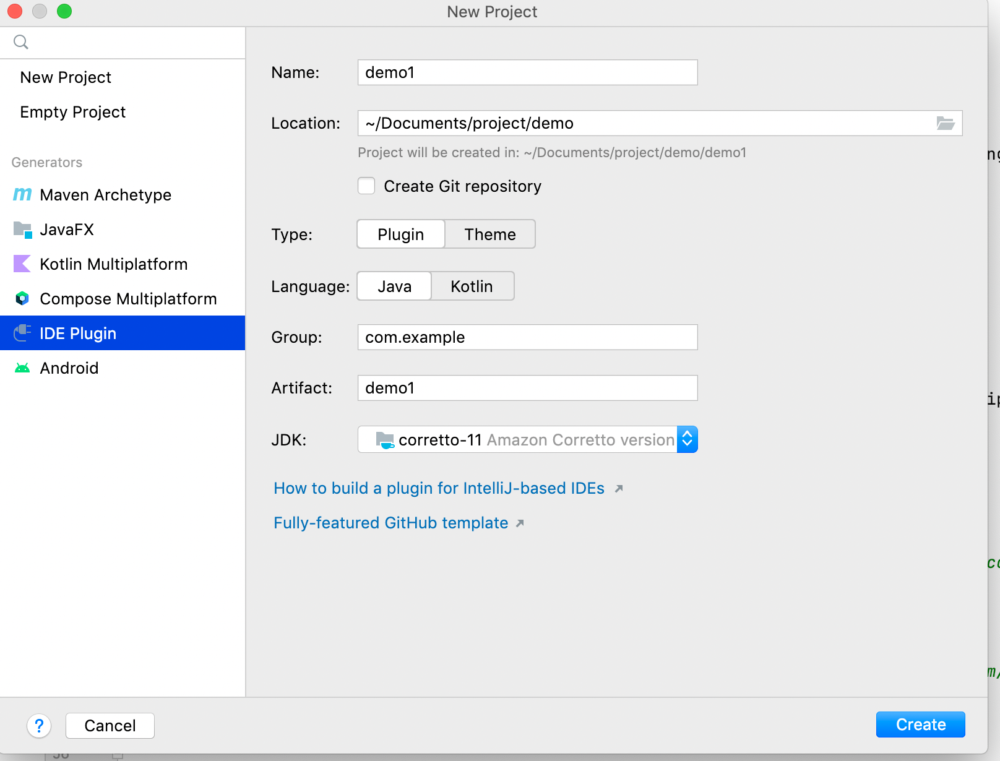

# 1、arthas idea document

- [https://www.yuque.com/arthas-idea-plugin](https://www.yuque.com/arthas-idea-plugin)

# 2、dev config

## 2.1 config plugin sdk

最新编译版本使用(2023.3)： https://www.jetbrains.com.cn/idea/download/other.html

example with IntelliJ IDEA Community Edition IC-221.6008.13

- add plugin sdk
  

- java runtime must height than java 11(version is 221.6008.13)
  

- IntelliJ IDEA Community Edition add sdk source file ,clone intellij-community source code,choose the specific version [https://github.com/JetBrains/intellij-community/tree/201.6668](https://github.com/JetBrains/intellij-community/tree/201.6668)

more you can
see: [https://www.yuque.com/arthas-idea-plugin/help/qf0s9y](https://www.yuque.com/arthas-idea-plugin/help/qf0s9y)

## 2.2 add plugin debug

plugin debug like java project,add a plugin debug,you can click debug will start a sandbox environment idea in new
windows

## 2.3 add dependency library

- current project not use gradle to manger dependency,use idea dependency library to manger

- library in .idea directory
  

## 2.4 GUI form designing

- GUI form designing,you can read this blog
  [https://corochann.com/intellij-plugin-development-introduction-gui-form-designing-456/](https://corochann.com/intellij-plugin-development-introduction-gui-form-designing-456/)

## 2.5 build deploy

- Click on the build directory below deployment button,you can see arthas-idea-plugin.zip file in project directory
  

# 3、More

### jetbrains plugin doc

- [https://plugins.jetbrains.com/docs/intellij/welcome.html](https://plugins.jetbrains.com/docs/intellij/welcome.html)

### create a plugin  project

if you create a new plugin，you can use two-way

- use
  template [https://lp.jetbrains.com/intellij-platform-plugin-template/](https://lp.jetbrains.com/intellij-platform-plugin-template/)

- use new project to create

### other blog

[从零开始编写IntelliJ IDEA插件](https://juejin.cn/post/6844904058625474573)

